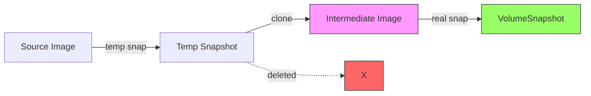
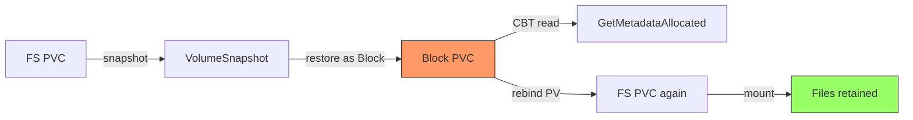
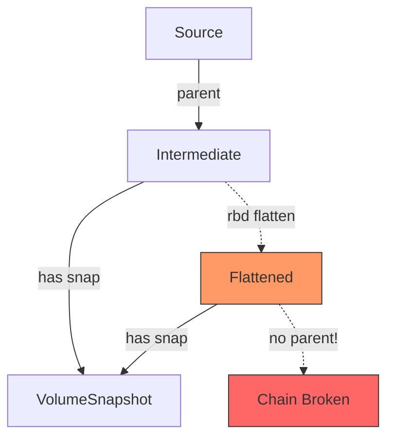

# CephCSI CBT Validation for Velero

Ceph RBD behavior coverage for incremental backup enablement

For CBT intro & getting started, see [k8s-cbt-s3mover-demo](https://github.com/kaovilai/k8s-cbt-s3mover-demo)

  
    Press Space to begin <carbon:arrow-right class="inline"/>
  

<!--
- This deck focuses on Ceph-specific CBT behaviors validated for Velero enablement
- CBT intro (KEP-3314, APIs, demo) is covered in the k8s-cbt-s3mover-demo presentation
- Goal: document what works, what doesn't, and what Velero needs to know about Ceph RBD
-->

---
transition: slide-left
---

# Why Ceph-Specific Validation?

CBT (KEP-3314) defines a generic API, but **each CSI driver has unique behaviors**.

<v-clicks>

- CephCSI uses an **intermediate image + snapshot** architecture (not direct snapshots)
- Clone chains and flattening create **Ceph-specific failure modes** for `GetMetadataDelta`
- Velero's Block Data Mover needs to know which **retention strategies** work with Ceph
- Volume mode conversion (FS to Block) has **Ceph-specific preconditions**

</v-clicks>

<v-click>

**This test suite validates Ceph RBD behaviors** that Velero must handle correctly for incremental backups on ODF/Rook clusters.

</v-click>

<!--
- Generic CBT tests (hostpath driver) don't exercise clone chains or flattening
- Ceph's snap-clone architecture means each VolumeSnapshot creates a new RBD image
- Velero can't treat Ceph like a simple snapshot-in-place driver
-->

---
transition: slide-left
---

# CephCSI Snap-Clone Architecture

Each VolumeSnapshot creates an **intermediate RBD image** -- not a direct snapshot on the source:

<v-clicks>

1. **Temp snapshot** on source PVC's RBD image
2. **Clone** to new intermediate image (format 2, deep-flatten)
3. **Delete** temp snapshot
4. **Snapshot** on intermediate image = VolumeSnapshot

</v-clicks>

<v-click>

</v-click>

<v-click>

Source PVC accumulates **zero** direct RBD snapshots. Each VolumeSnapshot gets its own intermediate image. This means `GetMetadataDelta` must traverse **across images** via parent chain.

</v-click>

<!--
- This architecture is critical to understand before looking at test results
- Intermediate images are what get flattened, not application volumes
- rbd diff --from-snap needs the parent chain intact to compute deltas
-->

---
transition: slide-left
---

# Validated Coverage Overview

| Area | Velero Relevance | Status |
|---|---|---|
| **GetMetadataAllocated** | Full backup: sparse block detection | Works |
| **GetMetadataDelta** | Incremental backup: changed blocks | Works (with caveats) |
| **Snapshot retention (Case 2)** | Keep previous snap for delta | Required for Ceph |
| **Snapshot retention (Case 1)** | Delete previous snap after backup | Fails on Ceph |
| **FS-to-Block volume mode** | Block Data Mover reads FS volumes as block | Works (KEP-3141) |
| **Rebind Block-to-FS** | Restore FS volume after block backup | Works |
| **Flattening prevention** | Shallow chains stay intact | Works (depth < soft limit) |
| **Post-flatten delta** | Delta after clone chain broken | Fails (no fallback) |
| **Volume resize + CBT** | CBT after PVC expansion | Works |
| **Error handling** | Invalid/deleted snapshot refs | Graceful errors |

<!--
- Green: works today, Velero can rely on it
- Case 1 retention is a hard constraint -- Velero must retain previous snapshot
- Post-flatten delta failure is expected -- no stored diffs mechanism exists
-->

---
transition: slide-left
---

# Snapshot Retention: Critical for Velero

Ceph RBD **requires** retaining the previous snapshot for `GetMetadataDelta`.

<v-click>

  <h3 class="text-red-600 dark:text-red-400 font-bold">Case 1: Delete Previous</h3>
  
Delete old snapshot after backup completes

  

  - `rbd diff` needs **both** snapshots in clone chain
  - Deleting breaks the chain
  - **Fails**: `"no snap source in omap"`

  

</v-click>

<v-click>

  <h3 class="text-green-600 dark:text-green-400 font-bold">Case 2: Retain Previous</h3>
  
Keep previous snapshot until next backup

  

  - Both snapshots remain in clone chain
  - `GetMetadataDelta` succeeds
  - **Required** for Ceph RBD

  

</v-click>

<v-click>

Ref: [Velero Block Data Mover Design -- Volume Snapshot Retention](https://github.com/Lyndon-Li/velero/blob/block-data-mover-design/design/block-data-mover/block-data-mover.md#volume-snapshot-retention)

</v-click>

<!--
- Velero design doc defines Case 1 and Case 2 retention strategies
- Ceph RBD requires Case 2 because rbd diff traverses parent chain
- Test: velero_compliance_test.go -- negative test asserts Case 1 fails
-->

---
transition: slide-left
---

# Volume Mode Conversion Workflow

Velero's Block Data Mover uses **Block PVCs** for backup, even for Filesystem sources.

<v-clicks>

1. Create **Filesystem** PVC, mount it, write files
2. Snapshot the Filesystem PVC
3. Restore snapshot as **Block** PVC (KEP-3141 annotation)
4. Read CBT metadata from Block PVC
5. **Rebind** the PV back to Filesystem mode
6. Mount rebound PV -- verify original files intact

</v-clicks>

<v-click>

</v-click>

<v-click>

Validated: CephCSI preserves filesystem data through the Block detour. KEP-3141 annotation on VolumeSnapshotContent enables the mode switch.

</v-click>

<!--
- KEP-3141 allows volume mode conversion via annotation on VolumeSnapshotContent
- This is how Velero does incremental backups of filesystem volumes via CBT
- Rebind proves the underlying data survives the Block detour
-->

---
transition: slide-left
---

# Flattening: The Clone Chain Risk

CephCSI flattens intermediate images to manage clone depth and snapshot counts.

<v-clicks>

- **Clone depth**: soft=4 (async), hard=8 (blocking)
- **Snapshot count**: max=450, min=250
- Only intermediate clones flattened
- **Flattening severs the parent chain**

</v-clicks>

<v-click>

</v-click>

<v-click>

After flattening: `GetMetadataDelta` **fails** -- `rbd diff` needs intact clone chain. No fallback exists today. `GetMetadataAllocated` may still work (snapshot-local diff).

</v-click>

<!--
- Flattening is threshold-based, not priority-based
- No mechanism to prefer flattening deleted snapshots over alive ones
- This is the fundamental tension between CBT and CephCSI's clone management
-->

---
transition: slide-left
---

# Flattening Prevention: What Works Today

Validated: CephCSI does **not** flatten when clone depth is below soft limit.

**PVC -> Snap -> Restore -> Snap**

<v-clicks>

- Snapshot a PVC
- Restore PVC from snapshot
- Snapshot the restored PVC
- Intermediate images: **NOT flattened**
- `GetMetadataDelta`: **works**

</v-clicks>

**PVC -> PVC Clone -> Snap**

<v-clicks>

- Clone a PVC (PVC-to-PVC)
- Write to clone
- Snapshot the clone
- Clone image: **NOT flattened**
- `GetMetadataDelta`: **works**

</v-clicks>

<v-click>

For typical Velero workflows (backup -> restore -> re-backup), clone depth stays at 1-2. Flattening is not triggered. CBT remains functional.

</v-click>

<!--
- Clone depth 1-2 is well below soft limit of 4
- Velero's normal backup-restore cycle doesn't accumulate deep chains
- Risk only emerges with many consecutive restore-from-snapshot cycles
-->

---
transition: slide-left
---

# Post-Flatten Behavior (Stored Diffs Gap)

What happens when flattening **does** break the chain?

<v-clicks>

1. Create PVC, write data, create 3 snapshots
2. Verify parent chains intact via RBD toolbox
3. **Force-flatten** all intermediate images (`rbd flatten`)
4. `GetMetadataAllocated` -- still works (snapshot-local)
5. `GetMetadataDelta` -- **fails** (no parent chain)
6. Verify omap: **no stored diffs** (CephCSI doesn't store them)

</v-clicks>

<v-click>

**Gap**: No "stored diffs in omap" mechanism exists. When flattening occurs, incremental backup capability is **permanently lost** for that snapshot pair. Velero must fall back to full backup.

Design proposals exist (priority-based flattening, stored diffs) but none are implemented in CephCSI.

</v-click>

<!--
- This test manually triggers flatten to document the gap
- CephCSI PR #5347 uses rbd DiffIterateByID directly -- no fallback
- Velero should detect delta failure and fall back to full backup gracefully
-->

---
transition: slide-left
---

# Volume Resize + CBT

Validated: CBT works correctly after PVC expansion.

<v-clicks>

- Create PVC (1Gi), write data, snapshot
- Expand PVC to 2Gi
- Write data to expanded region
- Snapshot expanded PVC
- `GetMetadataAllocated` on new snapshot: reports blocks in expanded region
- `GetMetadataDelta` between pre/post-resize: reports only new blocks

</v-clicks>

<v-click>

Velero can handle PVC resizes between backup cycles -- CBT correctly tracks blocks across size changes.

</v-click>

<!--
- Volume resize doesn't break clone chains
- rbd diff handles images of different sizes correctly
- Important for real-world scenarios where PVCs grow over time
-->

---
transition: slide-left
---

# Error Handling Validation

How CephCSI CBT responds to invalid requests:

<v-clicks>

| Scenario | Expected Behavior | Validated |
|---|---|---|
| Deleted VolumeSnapshot | Error with snapshot not found | Yes |
| Non-existent snapshot name | Error, no crash | Yes |
| Delta with unrelated snapshots | Error (not in same chain) | Yes |
| Delta with same snapshot twice | Error or empty result | Yes |
| Snapshot from different PVC | Error (different images) | Yes |

</v-clicks>

<v-click>

Velero needs graceful error handling from the driver to decide when to fall back to full backup vs. reporting a real failure.

</v-click>

<!--
- Error handling is important for Velero's retry/fallback logic
- CephCSI returns descriptive errors, not panics
- These tests ensure the sidecar + driver handle edge cases correctly
-->

---
transition: slide-left
---

# Summary: What Velero Needs to Know

**Works Today**
- `GetMetadataAllocated` for full backup
- `GetMetadataDelta` for incremental (with retention)
- FS-to-Block conversion (KEP-3141)
- Block-to-FS rebind after backup
- Volume resize between backups
- Shallow clone chains (typical workflows)
- Graceful error responses

**Constraints & Gaps**
- **Must retain** previous snapshot (Case 2)
- Delta **fails** after flattening (no fallback)
- No stored diffs mechanism
- No priority-based flattening
- No ROX shallow volumes for RBD
- Clone depth > 4 triggers flatten risk
- 450+ snapshots per image trigger flatten

<v-click>

**Velero implementation guidance**: Use Case 2 retention. Detect `GetMetadataDelta` failures and fall back to full backup. Normal backup-restore cycles stay within safe clone depth.

</v-click>

<!--
- Velero can rely on CBT for Ceph today with Case 2 retention
- Flattening risk is low for typical workflows but must be handled
- Future CephCSI improvements (stored diffs, priority flatten) would remove constraints
-->

---
transition: slide-left
---

# Key References

**CephCSI CBT**
- [PR #5347](https://github.com/ceph/ceph-csi/pull/5347) -- CBT RPCs (merged Jul 2025)
- [Issue #5346](https://github.com/ceph/ceph-csi/issues/5346) -- CBT feature request
- [Design: rbd-snap-clone.md](https://github.com/ceph/ceph-csi/blob/devel/docs/design/proposals/rbd-snap-clone.md)

**Flattening**
- [PR #2900](https://github.com/ceph/ceph-csi/pull/2900) -- Flatten before create
- [PR #1678](https://github.com/ceph/ceph-csi/pull/1678) -- minSnapshotsOnImage
- [Issue #1800](https://github.com/ceph/ceph-csi/issues/1800) -- No-flatten request

**Velero**
- [Block Data Mover Design](https://github.com/Lyndon-Li/velero/blob/block-data-mover-design/design/block-data-mover/block-data-mover.md)
- [Velero CBT Integration Plan](https://hackmd.io/@velero/r1U1EVKdgl)

**Setup & Getting Started**
- [CBT sidecar for ODF](https://access.redhat.com/articles/7130698)
- [k8s-cbt-s3mover-demo](https://github.com/kaovilai/k8s-cbt-s3mover-demo) -- CBT intro & demo
- [This test suite](https://github.com/kaovilai/cephcsi-cbt-e2e)

<!--
- PR #5347 is the core CBT implementation using rbd DiffIterateByID
- Block Data Mover design doc defines retention strategies
- k8s-cbt-s3mover-demo covers CBT basics and getting started
-->

---
layout: center
class: text-center
---

# Thank You!

Questions?

  
CephCSI CBT Validation for Velero

  
github.com/kaovilai/cephcsi-cbt-e2e

<!--
- Repo: github.com/kaovilai/cephcsi-cbt-e2e
- CBT intro: github.com/kaovilai/k8s-cbt-s3mover-demo
- CBT sidecar setup: access.redhat.com/articles/7130698
-->
