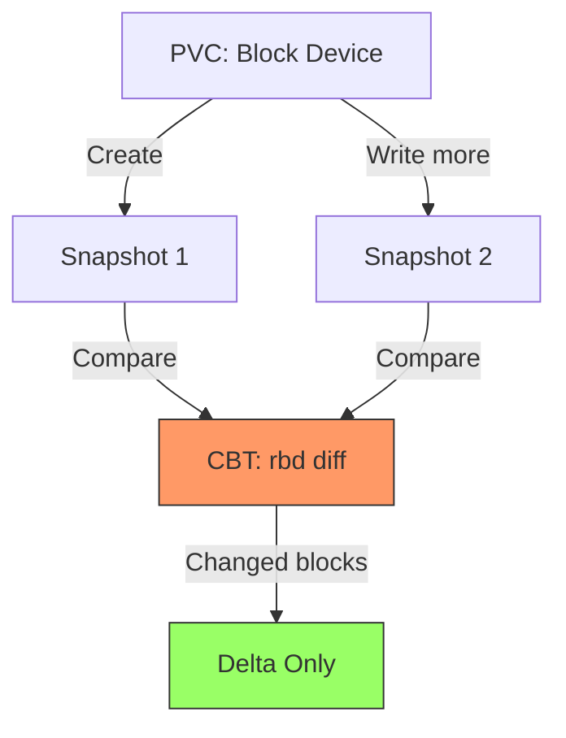
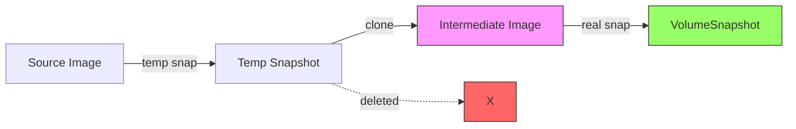
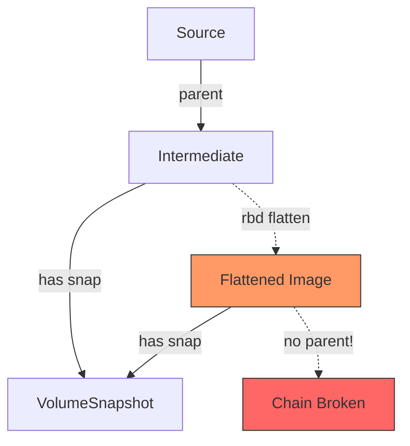
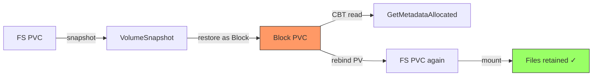

# CephCSI CBT E2E Test Suite

Validating Changed Block Tracking for Ceph RBD

<div class="pt-12">
  <span @click="$slidev.nav.next" class="px-2 py-1 rounded cursor-pointer" hover="bg-white bg-opacity-10">
    Press Space to begin <carbon:arrow-right class="inline"/>
  </span>
</div>

<!--
- E2E test suite for Ceph RBD Changed Block Tracking via Kubernetes CSI external-snapshot-metadata API
- Tests validate incremental backup capabilities needed by Velero and similar backup tools
- Requires live K8s 1.33+ cluster with CephCSI, ODF/Rook, and external-snapshot-metadata sidecar
-->


---
transition: slide-left
---

# What is CBT?

Changed Block Tracking (**KEP-3314**) identifies **only the blocks** that changed between snapshots.

<div class="grid grid-cols-2 gap-8 mt-4">
<div>

<v-clicks>

- **K8s 1.33** -- Alpha (no feature gate)
- **OCP 4.20** -- DevPreviewNoUpgrade
- **K8s 1.36** -- Proposed Beta target

</v-clicks>

<v-click>
<div class="mt-4 p-2 bg-yellow-900 bg-opacity-20 rounded text-sm">

CBT is supported only for **block volumes**, not file volumes

</div>
</v-click>

</div>
<div>

<v-click>



</v-click>

</div>
</div>

<!--
- KEP-3314 introduces CBT as alpha in K8s 1.33+
- Ceph RBD has had `rbd diff` for years -- CBT standardizes access via CSI
- Block volumes only -- this is critical for test design
-->

---
transition: slide-left
---

# Two Key APIs

<div class="grid grid-cols-2 gap-8 mt-8">

<v-click>
<div class="p-4 border border-blue-500 rounded bg-blue-50 dark:bg-blue-900/20">
  <h3 class="text-blue-600 dark:text-blue-400 font-bold">GetMetadataAllocated</h3>
  <p class="mt-2">All allocated blocks in a single snapshot</p>
  <div class="mt-4 text-sm font-mono">Use case: Initial full backup</div>
  <div class="mt-2 text-sm font-mono">Backs: rbd snap diff &lt;image&gt;@&lt;snap&gt;</div>
</div>
</v-click>

<v-click>
<div class="p-4 border border-green-500 rounded bg-green-50 dark:bg-green-900/20">
  <h3 class="text-green-600 dark:text-green-400 font-bold">GetMetadataDelta</h3>
  <p class="mt-2">Blocks changed between two snapshots</p>
  <div class="mt-4 text-sm font-mono">Use case: Incremental backup</div>
  <div class="mt-2 text-sm font-mono">Backs: rbd diff --from-snap</div>
</div>
</v-click>

</div>

<!--
- GetMetadataAllocated: sparse region detection, skip unallocated blocks
- GetMetadataDelta: only transfer what changed since last backup
- Both backed by rbd DiffIterateByID in CephCSI (PR #5347)
-->

---
transition: slide-left
---

# CephCSI Snap-Clone Architecture

How CephCSI creates VolumeSnapshots internally:

<v-clicks>

1. **Temp snapshot** on source PVC's RBD image
2. **Clone** to new intermediate image (format 2, deep-flatten)
3. **Delete** temp snapshot
4. **Create** real snapshot on intermediate image

</v-clicks>

<v-click>



</v-click>

<v-click>
<div class="mt-2 p-2 bg-yellow-900 bg-opacity-20 rounded text-sm">

Source PVC accumulates **zero** direct RBD snapshots. Each VolumeSnapshot gets its own intermediate image.

</div>
</v-click>

<!--
- This architecture means the 250/450 snapshot limits apply per-image
- Intermediate images are what get flattened, not application volumes
- Understanding this is essential for designing CBT tests
-->

---
transition: slide-left
---

# The Flattening Problem

CephCSI flattens intermediate images to manage clone chains:

<div class="grid grid-cols-2 gap-6 mt-4">
<div>

<v-clicks>

- **Clone depth**: soft=4, hard=8
- **Snapshot count**: max=450, min=250
- Only intermediate clones flattened
- **Flattening breaks clone chain**

</v-clicks>

</div>
<div>

<v-click>



</v-click>

</div>
</div>

<v-click>
<div class="mt-2 p-2 bg-red-900 bg-opacity-20 rounded text-sm">

After flattening: `GetMetadataDelta` **fails** -- `rbd diff` needs intact clone chain. No fallback exists today.

</div>
</v-click>

<!--
- Flattening collapses the clone chain -- rbd diff can't traverse across flattened images
- "Combined solution" (stored diffs in omap) is a design proposal, NOT implemented
- This is why the stored_diffs_test.go force-flattens and verifies failure
-->

---
transition: slide-left
---

# Test Suite Architecture

```
pkg/
  cbt/    -- gRPC client: GetAllocatedBlocks, GetChangedBlocks
  k8s/    -- K8s resource lifecycle (PVC, Pod, Snapshot, Namespace)
  data/   -- Block device writes (dd), SHA256 hash reads
  rbd/    -- Ceph RBD introspection via toolbox pod exec
tests/e2e/  -- Ginkgo v2 BDD test suite (Ordered containers)
```

<v-click>

<div class="grid grid-cols-2 gap-4 mt-4 text-sm">
<div>

**Test Infrastructure**
- Ginkgo v2 with `Ordered` containers
- BeforeAll/AfterAll for resource lifecycle
- Gomega matchers (dot-imported)
- BeforeSuite validates cluster preconditions

</div>
<div>

**Cluster Requirements**
- K8s 1.33+ with CBT CRD
- ODF 4.18+ with CephCSI
- external-snapshot-metadata sidecar
- Ceph toolbox pod for RBD inspection
- **Must run in-cluster** (gRPC uses cluster DNS)
- BeforeSuite validates DNS, fails fast → `run-in-cluster.sh`

</div>
</div>

</v-click>

<!--
- pkg/ provides reusable helpers for all test files
- Tests use Ordered containers: setup -> assertions -> cleanup
- BeforeSuite checks K8s version, CRDs, CephCSI pods, sidecar, Ceph version
-->

---
transition: slide-left
---

# Test Categories

<div class="text-sm">

| Category | What It Tests | Key Assertion |
|---|---|---|
| **Basic CBT** | GetAllocatedBlocks, GetChangedBlocks | Block offsets match written data |
| **ROX PVC** | ReadOnlyMany from snapshots | No RBD flattening occurs |
| **Counter Deletion** | Snapshot deletion behavior | Counter-based RBD cleanup |
| **Flattening Prevention** | Snap->Restore->Snap chains | `IsImageFlattened() == false` |
| **Stored Diffs** | Force-flatten via `rbd flatten` | Delta fails without stored diffs |
| **Error Handling** | Invalid/deleted snapshots | Graceful error responses |
| **Backup Workflow** | End-to-end backup simulation | Snapshot retention works |
| **Velero Compliance** | Handle-based delta, retention cases | Case 1 fails, Case 2 works |
| **Volume Mode Rebind** | FS→Block→rebind→FS workflow | Files retained after rebind |

</div>

<v-click>

```bash
make e2e          # Full suite (5h)
make e2e-fast     # Skip stored-diffs (2h)
make e2e-flattening  # Just flattening tests (30m)
```

</v-click>

<!--
- Each category tests a different aspect of CBT + CephCSI interaction
- Stored diffs test is the most interesting: manually breaks clone chain
- make targets allow running individual categories
-->

---
transition: slide-left
---

# Velero Retention: Case 1 vs Case 2

How should backup tools handle previous snapshots when computing deltas?

<div class="grid grid-cols-2 gap-6 mt-4">
<div>

<v-click>
<div class="p-3 border border-red-500 rounded bg-red-50 dark:bg-red-900/20">
  <h3 class="text-red-600 dark:text-red-400 font-bold">Case 1: No Retention</h3>
  <p class="mt-2 text-sm">Delete previous snapshot after backup</p>
  <div class="mt-2 text-sm">

  - `rbd snap diff` needs **both** snapshots in clone chain
  - Deleting the previous snapshot breaks the chain
  - **Fails** with `"no snap source in omap"`

  </div>
</div>
</v-click>

</div>
<div>

<v-click>
<div class="p-3 border border-green-500 rounded bg-green-50 dark:bg-green-900/20">
  <h3 class="text-green-600 dark:text-green-400 font-bold">Case 2: Retain Previous</h3>
  <p class="mt-2 text-sm">Keep previous snapshot for delta computation</p>
  <div class="mt-2 text-sm">

  - Both snapshots remain in clone chain
  - `GetMetadataDelta` succeeds
  - **Required** for Ceph RBD

  </div>
</div>
</v-click>

</div>
</div>

<v-click>
<div class="mt-3 p-2 bg-blue-900 bg-opacity-20 rounded text-sm">

Test: `velero_compliance_test.go` -- negative test asserts Case 1 fails, positive test confirms Case 2 works.
Ref: [Velero Block Data Mover Design](https://github.com/Lyndon-Li/velero/blob/block-data-mover-design/design/block-data-mover/block-data-mover.md#volume-snapshot-retention)

</div>
</v-click>

<!--
- Velero design doc defines Case 1 and Case 2 retention strategies
- Ceph RBD requires Case 2 because rbd diff traverses parent chain
- Negative test proves Case 1 is incompatible with Ceph
-->

---
transition: slide-left
---

# Volume Mode Rebind Test

Velero's Block Data Mover always uses **Block-mode PVCs** for backup, even for Filesystem sources.

<v-clicks>

1. Create **Filesystem** PVC, mount it, write files
2. Snapshot the Filesystem PVC
3. Restore snapshot as **Block** PVC (KEP-3141 annotation on VolumeSnapshotContent)
4. Read CBT metadata from Block PVC
5. **Rebind** the PV back to Filesystem mode
6. Mount rebound PV and verify original files are intact

</v-clicks>

<v-click>



</v-click>

<v-click>
<div class="mt-2 p-2 bg-yellow-900 bg-opacity-20 rounded text-sm">

Test: `volume_mode_rebind_test.go` -- validates the full FS→Block→rebind→FS workflow with data integrity checks.

</div>
</v-click>

<!--
- KEP-3141 allows volume mode conversion via annotation on VolumeSnapshotContent
- This is how Velero would do incremental backups of filesystem volumes via CBT
- Rebind proves the underlying data survives the Block detour
-->

---
transition: slide-left
---

# Stored Diffs Test: Force-Flatten

The most interesting test -- simulates what happens when flattening breaks CBT:

<v-clicks>

1. Create PVC, write data, create 3 snapshots
2. Find intermediate RBD images via source image's children
3. Verify parent chains intact (`IsImageFlattened() == false`)
4. **Force-flatten** all intermediates via `rbd flatten`
5. Verify `IsImageFlattened() == true`
6. Assert: `GetMetadataAllocated` may still work
7. Assert: `GetMetadataDelta` **fails** (no chain, no stored diffs)
8. Verify omap has no diff keys (manual flatten bypasses CephCSI)

</v-clicks>

<v-click>
<div class="mt-2 p-2 bg-blue-900 bg-opacity-20 rounded text-sm">

This proves WHY stored diffs are needed: without them, flattening permanently breaks incremental backups.

</div>
</v-click>

<!--
- Manual rbd flatten bypasses CephCSI entirely
- CephCSI never stores diffs in omap because it wasn't involved
- This test documents the gap that the Combined solution design would fill
-->

---
transition: slide-left
---

# Flattening Prevention Tests

Verify CephCSI does NOT flatten when clone depth is shallow:

<div class="grid grid-cols-2 gap-6 mt-4">
<div>

**PVC -> Snap -> Restore -> Snap**

<v-clicks>

- Create PVC, write data, snapshot
- Restore PVC from snapshot
- Write more data, snapshot restored PVC
- Assert: restored PVC image NOT flattened
- Assert: CBT works across the chain

</v-clicks>

</div>
<div>

**PVC -> PVC Clone -> Snap**

<v-clicks>

- Create PVC, write data
- Clone PVC (PVC-PVC clone)
- Write to clone, snapshot clone
- Assert: clone image NOT flattened
- Assert: CBT works on clone's snapshot

</v-clicks>

</div>
</div>

<!--
- These test chains where clone depth is 1, well below soft limit of 4
- Ensures CephCSI doesn't over-flatten in common backup workflows
- Important for Velero: restore -> re-snapshot is a normal pattern
-->

---
transition: slide-left
---

# Combined Solution (Design Proposal)

A design for CBT + flattening coexistence -- **not yet implemented**:

<div class="text-sm">

<v-clicks>

1. **ROX shallow volumes** -- Prevent 3+ clone depth (CephFS has this; RBD does not)
2. **Counter-based deletion** -- Reference tracking for snapshots (CephFS only today)
3. **Flattening prevention** -- Move flatten logic earlier ([PR #2900](https://github.com/ceph/ceph-csi/pull/2900), partial)
4. **Priority-based flattening** -- Flatten deleted snaps first, clones next, alive snaps last
5. **Stored diffs in omap** -- Doubly-linked list of diffs before flattening

</v-clicks>

</div>

<v-click>
<div class="mt-4 p-3 bg-red-900 bg-opacity-20 rounded text-sm">

**Current reality**: CephCSI CBT ([PR #5347](https://github.com/ceph/ceph-csi/pull/5347)) uses `rbd DiffIterateByID` directly. If an intermediate image is flattened, GetMetadataDelta fails with **no fallback**.

</div>
</v-click>

<!--
- Combined solution is a design document, not code
- Stored diffs in omap would allow CBT beyond 250 snapshots
- Priority flattening would preserve alive snapshot chains
- Today: flattening = broken CBT, full backup required
-->

---
transition: slide-left
---

# ODF Version Compatibility

The test suite handles multiple ODF versions for pod/label discovery:

<v-clicks>

- **ODF < 4.18**: label `app=csi-rbdplugin-provisioner`
- **ODF 4.18+**: label `app.kubernetes.io/name=csi-rbdplugin,app.kubernetes.io/component=ctrlplugin`
- **ODF 4.21+**: fallback to pod name pattern matching (`rbd` + `ctrlplugin`)

</v-clicks>

<v-click>

```go
// pkg/k8s/k8s.go - Auto-discovery logic
pods, err := FindCephCSIPods(ctx, clientset, namespace)
// Tries each label selector, falls back to name matching
```

</v-click>

<v-click>
<div class="mt-4 p-2 bg-blue-900 bg-opacity-20 rounded text-sm">

Setup automated via `ocp-setup/` scripts (featuregate, ODF install, StorageCluster, CBT sidecar)

</div>
</v-click>

<!--
- CephCSI pod labels changed across ODF versions
- Test suite auto-detects using fallback chain
- ocp-setup/ directory has step-by-step scripts for cluster setup
-->

---
transition: slide-left
---

# Key CephCSI References

<div class="grid grid-cols-2 gap-4 text-sm">
<div>

**CBT Implementation**
- [PR #5347](https://github.com/ceph/ceph-csi/pull/5347) -- CBT RPCs (merged Jul 2025)
- [Issue #5346](https://github.com/ceph/ceph-csi/issues/5346) -- CBT feature request
- [KEP-3314](https://github.com/kubernetes/enhancements/blob/master/keps/sig-storage/3314-csi-changed-block-tracking/README.md) -- Spec

**Flattening**
- [PR #2900](https://github.com/ceph/ceph-csi/pull/2900) -- Flatten before create
- [PR #1678](https://github.com/ceph/ceph-csi/pull/1678) -- minSnapshotsOnImage
- [Design: rbd-snap-clone.md](https://github.com/ceph/ceph-csi/blob/devel/docs/design/proposals/rbd-snap-clone.md)

</div>
<div>

**CephFS (reference for RBD proposals)**
- [PR #3651](https://github.com/ceph/ceph-csi/pull/3651) -- ROX shallow volumes
- [PR #2893](https://github.com/ceph/ceph-csi/pull/2893) -- Reference tracker

**Related**
- [Issue #1800](https://github.com/ceph/ceph-csi/issues/1800) -- No-flatten request
- [Velero CBT Plan](https://hackmd.io/@velero/r1U1EVKdgl)
- [k8s-cbt-s3mover-demo](https://github.com/kaovilai/k8s-cbt-s3mover-demo) -- Getting started

</div>
</div>

<!--
- PR #5347 is the core CBT implementation using rbd DiffIterateByID
- rbd-snap-clone.md explains the snap-clone architecture and depth limits
- CephFS PRs show what RBD proposals would look like when implemented
- k8s-cbt-s3mover-demo is a simpler getting-started project
-->

---
layout: center
class: text-center
---

# Thank You!

Questions?

<div class="pt-12 text-sm opacity-50">
  <p>CephCSI CBT E2E Test Suite</p>
  <p>github.com/kaovilai/cephcsi-cbt-e2e</p>
</div>

<!--
- Repo: github.com/kaovilai/cephcsi-cbt-e2e
- Getting started: github.com/kaovilai/k8s-cbt-s3mover-demo
- CBT sidecar setup for ODF: access.redhat.com/articles/7130698
-->
